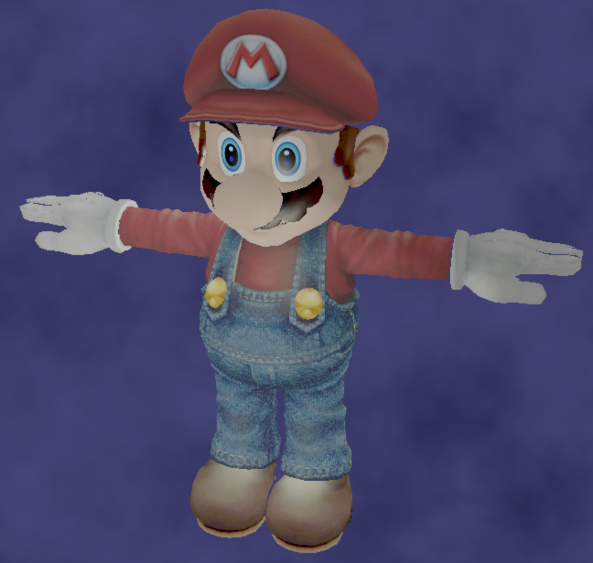
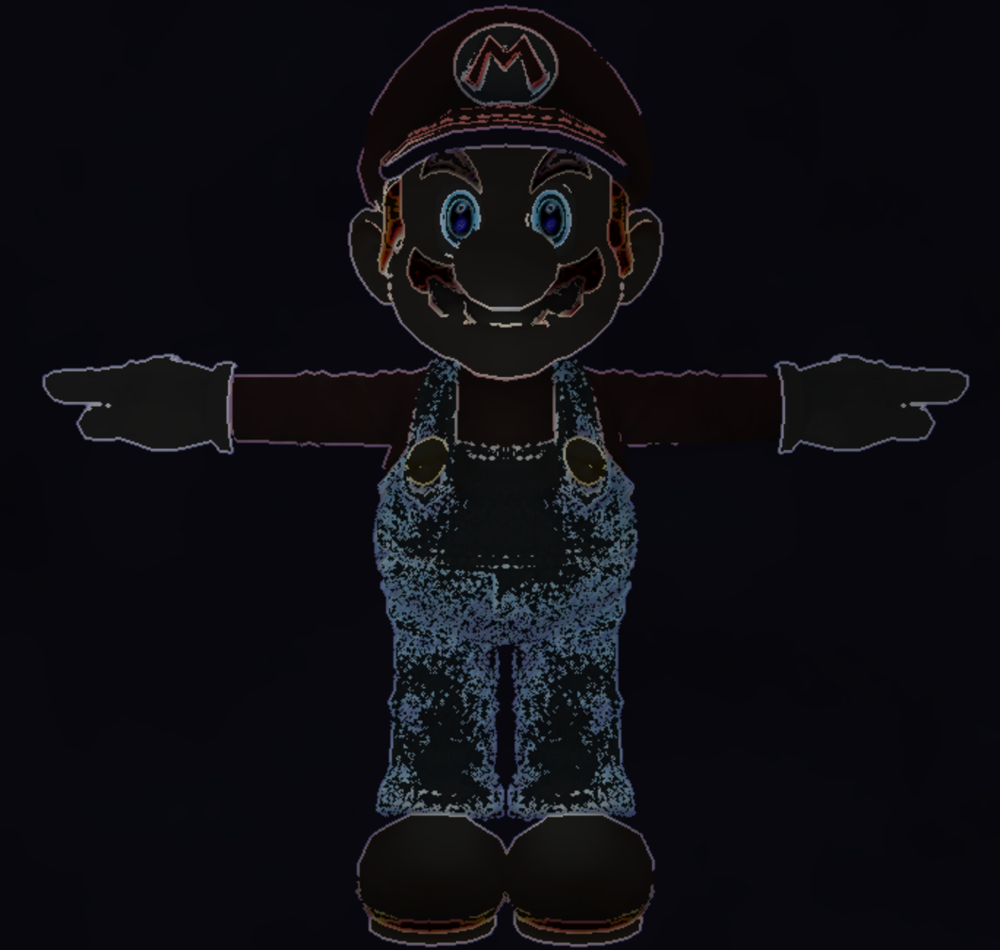
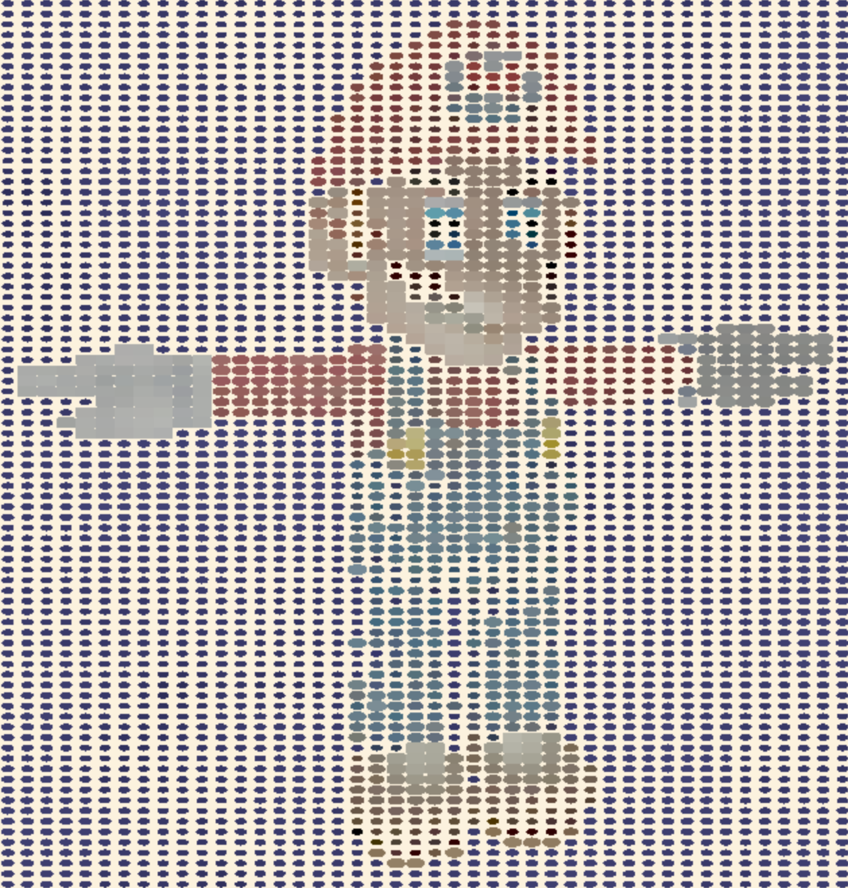

# Deferred Renderer - Salaar Kohari

## About
- Custom post process shaders made with WebGL and TypeScript
- Created for CIS 566 - Procedural Computer Graphics
- Salaar Kohari (PennKey: salaar)

## Features
- Blinn-Phong reflection model
- Implementation of tonemapping function by Jim Hejl and Richard Burgess-Dawson
- Sobel filter (edge-detection algorithm removes color from non-edges)
- Pointilism filter sets color to rounded pixel texture and sets size using color
- Gaussian blurs the image using a Gaussian distribution
- Anti-aliasing (similar edge-detection but with different parameters and a blur function)
- Dat.gui allows for toggling of features to test their effects individually

## Resources
- Javascript Modules https://developer.mozilla.org/en-US/docs/Web/JavaScript/Reference/Statements/import
- Typescript https://www.typescriptlang.org/docs/home.html
- dat.gui https://workshop.chromeexperiments.com/examples/gui/
- glMatrix http://glmatrix.net/docs/
- WebGL https://developer.mozilla.org/en-US/docs/Web/API/WebGL_API
- [FXAA](http://blog.simonrodriguez.fr/articles/30-07-2016_implementing_fxaa.html)